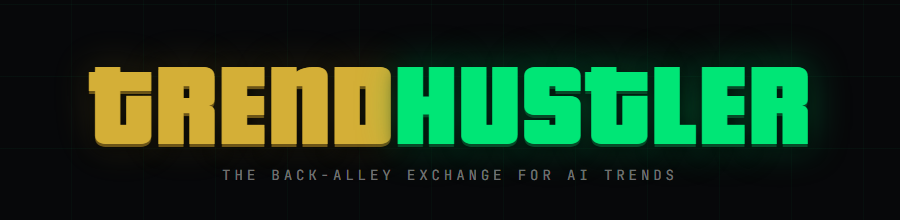

<p align="center">
  
</p>

> *"Everybody wants to go viral. Nobody wants to post first."*

---

## What is this?

It's a dashboard that tells you which AI topics to post about **before everyone else does.**

Not after they're trending. Not while they're trending. **Before.**

It watches 8 sources where developers, researchers, and builders talk about AI — places like GitHub, Hacker News, Reddit, and arXiv. Then it checks how much mainstream media and YouTube has already covered those topics.

The gap between those two numbers? **That's your window.**

---

## The problem it solves

Right now, most creators pick their topics like this:

1. See something trending on Twitter
2. Google it
3. Find 200 videos already made about it
4. Make video number 201
5. Get 40 views

TrendHustler flips that. It finds topics that are **hot in the developer underground but cold in the mainstream** — so you can post first, not last.

---

## The signals

Every AI topic on the board gets one of five signals:

**💎 STRONG BUY** — Developers are buzzing. Media hasn't touched it. You have the whole field to yourself. Post today.

**🟢 BUY** — Growing fast underground. Mainstream is just waking up. You still have time. Move this week.

**🟡 HOLD** — It's peaking. The wave is here. Post today or the window closes.

**🔴 SELL** — Saturated. Every newsletter, every podcast, every LinkedIn post is covering this. You're too late.

**☠️ RUG** — Dead. It was hot. Now it's a corpse. Don't let anyone see you posting about this.

---

## What the numbers mean

**Saturation %** — how mainstream the topic already is.

```
$GRAPHRAG    sat 0%   → almost nobody in media covers this yet. Pure underground. 💎
$GEMINI      sat 66%  → already everywhere. Two-thirds mainstream. Move on.
```

**Posting window** — how many days you have before it goes fully mainstream.

```
⏳ 60 days left  → plenty of time. Plan your video properly.
⏳ 4 days left   → drop everything. Record today.
❌ CLOSED        → the window is gone. Skip it.
```

**Daily change %** — how fast the topic is growing right now.

```
+81% today  → accelerating hard. This thing is about to blow up.
-52% today  → dying fast. Nobody's clicking it anymore.
```

---

## Real data from this morning

Here is what TrendHustler found when it ran today:

> **💎 $GRAPHRAG — STRONG BUY**
> Saturation: 0% mainstream. Window: 60 days.
> *"A year ago, everyone ignored it. Right now, developers are obsessed with it. Mainstream hasn't noticed yet."*
> → Make the video. Be first.

> **☠️ $SAFETY — RUG**
> Down 52% in 48 hours. Mainstream coverage was everywhere last week.
> *"The discourse died. The algorithm moved on."*
> → Don't get caught holding this one.

---

## Who this is for

**YouTube creators in AI** — find what to make your next video about before your competitors do.

**Newsletter writers** — cover what's happening in AI before it lands in every major publication.

**LinkedIn creators** — stop being the person who posts about things two weeks late.

**Anyone in the AI space** — know what's actually moving underground before it hits the front page.

---

## How to use it

### Option A — GitHub Pages (no setup, always fresh)

The dashboard at **[hustlerv369.github.io/trendhustler](https://hustlerv369.github.io/trendhustler)** refreshes automatically every day at 6am UTC via GitHub Actions.

Open it. That's it.

### Option B — Run it locally (get data right now)

```bash
# Step 1 — install yt-dlp (for the YouTube source)
# Windows:   winget install yt-dlp
# Mac/Linux: pip install yt-dlp

# Step 2 — pull fresh data and build the dashboard (~12 seconds)
# No npm install needed — zero external dependencies
npm run build

# Step 3 — open index.html in your browser
# Double-click it. No server. No account. No setup.
```

To refresh data anytime:
```bash
npm run refresh
```

### Auto-refresh (how it works)

A GitHub Action runs every day at 6am UTC. It pulls fresh data from all 8 sources, rebuilds `index.html`, and commits the result. GitHub Pages picks it up automatically.

You can also trigger it manually anytime: **Actions tab → Daily Data Refresh → Run workflow.**

---

## What it watches (8 sources, zero dollars)

| Source | What it reads |
|--------|--------------|
| **Hacker News** | What engineers actually discuss |
| **GitHub** | Which AI repos are gaining stars right now |
| **arXiv** | Fresh research papers (products follow research by months) |
| **Hugging Face** | Which AI models practitioners are adopting |
| **Dev.to** | What developers are writing and reading |
| **Reddit** | r/LocalLLaMA · r/MachineLearning · r/singularity + more |
| **Product Hunt** | New AI tools launching today |
| **YouTube** | What creators are already covering |
| **Google News** | How much mainstream media coverage exists |

No API keys. No paid subscriptions. No Apify. Every source is either a free official API, an RSS feed, or yt-dlp.

---

## The dashboard has personality

- **Click the logo** → 💸 money rain
- **Konami code** (↑↑↓↓←→←→ B A) → 💎 Diamond Hands Mode
- **Sound on** → ka-ching on BUY · siren on RUG · sad trombone on DUMP
- **Click any row** → dealer verdict + real links to the actual sources so you can make content from them immediately

---

## MCP Server — ask your AI assistant

Works with Claude Code and Antigravity.

**The MCP server always has fresh data.** If your local data is older than 23 hours, it automatically fetches the latest snapshot from GitHub (updated daily). No manual refresh needed.

### Setup — Claude Code

```bash
# Clone the repo once
git clone https://github.com/hustlerv369/trendhustler
cd trendhustler

# Add the MCP server (one-time setup)
claude mcp add trendhustler node /absolute/path/to/trendhustler/mcp/server.mjs
```

### Setup — Antigravity

Add this to your Antigravity MCP config:

```json
{
  "mcpServers": {
    "trendhustler": {
      "command": "node",
      "args": ["/absolute/path/to/trendhustler/mcp/server.mjs"]
    }
  }
}
```

### Then ask your AI

```
"What AI topics should I post about today?"
"Should I make a video about GraphRAG?"
"What is the AI market mood right now?"
```

Three tools: `whats_pumping` · `should_i_post_about` · `market_mood`

Full setup guide with copy-paste configs: [hustlerv369.github.io/trendhustler/mcp/](https://hustlerv369.github.io/trendhustler/mcp/)

---

## The bottom line

TrendHustler is a **timing tool for AI content creators.**

It does not tell you what to think. It tells you **when to move.**

Find the gap between what developers are talking about and what's already in the mainstream. Post in that gap. That is the whole game.

*"The streets never sleep. Neither does the data pipeline."* 🕶️

---

*Built for Jack Roberec's AI Automator Community — May 2026 Competition.*
*8 free sources · no API keys · no Apify · ~12 second refresh*
